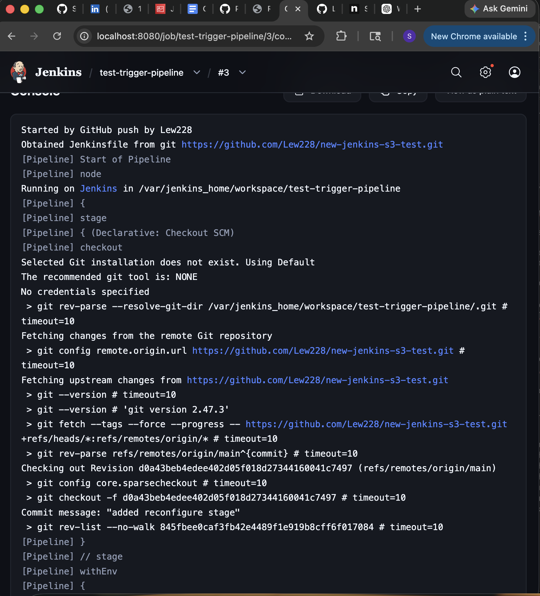
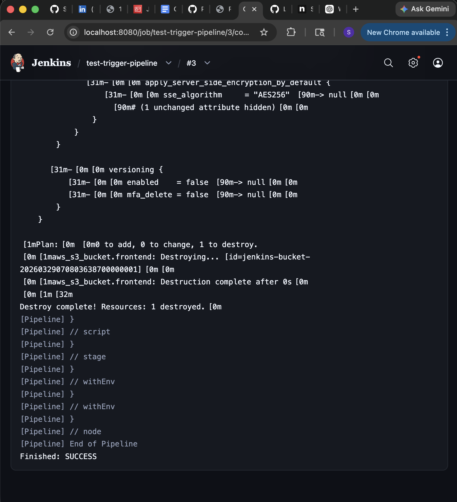
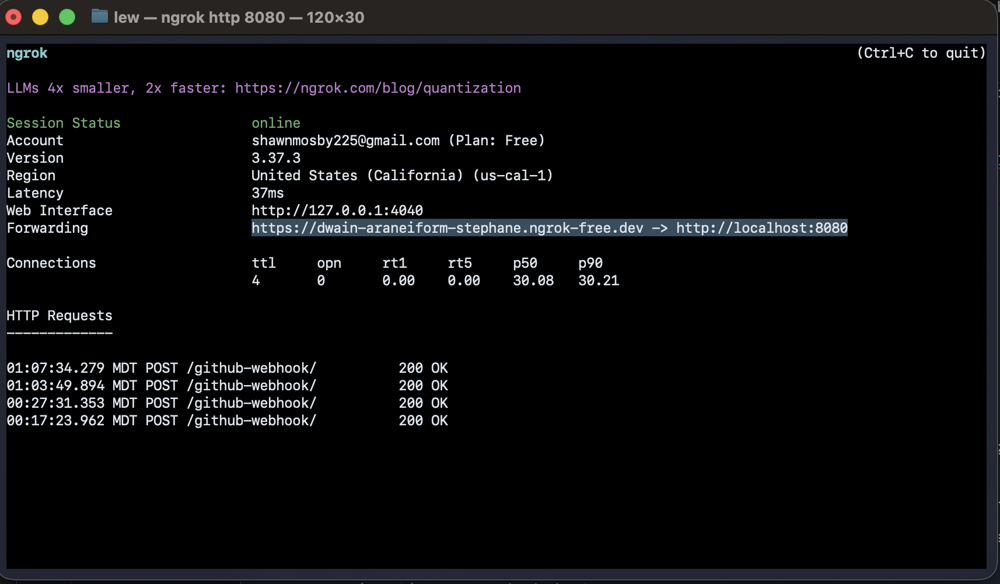

# New Jenkins server test with terraform deployment and triggers

## Jenkinsfile

A simple declarative Jenkinsfile
- Clones git repo 
- Binds AWS IAM user creds in terraform stages with AWS Creds plugin
- Stages for terraform init and apply 
- Destroy stage using user input 

## Terraform script 
- A simple AWS S3 bucket is deployed
- State file is stored in S3 backend 
- S3 bucket name uniqueness is guranteed 

## User data
EC2 startup script to bootstrap Jenkins server

## Screenshots

### Working Webhook Trigger


### Successful Terraform Deployment via Jenkins


# Jenkins + Terraform S3 Deployment

This project demonstrates a Jenkins pipeline triggered by a GitHub webhook that deploys AWS infrastructure using Terraform. The pipeline checks out the repository, initializes Terraform with an S3 remote backend, applies the infrastructure, and optionally destroys the resources after deployment.

## Technologies Used

- Jenkins
- GitHub Webhook
- Terraform
- AWS S3
- Docker Desktop
- ngrok

## Project Overview

The Jenkins pipeline is triggered automatically by a GitHub push event. Jenkins then pulls the repository, runs `terraform init -reconfigure`, creates an execution plan, and applies the Terraform configuration to AWS. The Terraform state is stored remotely in an S3 backend bucket.

## Jenkins Pipeline

Final `Jenkinsfile`:

```groovy
pipeline {
    agent any

    environment {
        AWS_DEFAULT_REGION = 'us-east-1'
        TF_IN_AUTOMATION   = 'true'
    }

    stages {
        stage('Checkout') {
            steps {
                checkout scm
            }
        }

        stage('Terraform Init') {
            steps {
                sh 'terraform init -reconfigure'
            }
        }

        stage('Terraform Apply') {
            steps {
                sh '''
                    terraform plan -out=tfplan
                    terraform apply -auto-approve tfplan
                '''
            }
        }

        stage('Optional Destroy') {
            steps {
                script {
                    def destroyChoice = input(
                        message: 'Do you want to run terraform destroy?',
                        ok: 'Submit',
                        parameters: [
                            choice(
                                name: 'DESTROY',
                                choices: ['no', 'yes'],
                                description: 'Select yes to destroy resources'
                            )
                        ]
                    )
                    if (destroyChoice == 'yes') {
                        sh 'terraform destroy -auto-approve'
                    } else {
                        echo "Skipping destroy"
                    }
                }
            }
        }
    }
}
```
## Terraform Configuration

Final `test-bucket.tf`:

```
terraform {
  required_providers {
    aws = {
      source  = "hashicorp/aws"
      version = "~> 5.0"
    }
  }

  backend "s3" {
    bucket  = "shawn-terraform-state-2026"
    key     = "jenkins-s3-test/terraform.tfstate"
    region  = "us-east-1"
    encrypt = true
  } 
}

provider "aws" {
  region  = "us-east-1"
}

resource "aws_s3_bucket" "frontend" {
  bucket_prefix = "jenkins-bucket-"
  force_destroy = true

  tags = {
    Name = "Jenkins Bucket"
  }
}
```
## Webhook Configuration

### The GitHub webhook was configured to send push events to Jenkins through `ngrok`.

- For this project, Jenkins was running locally in Docker Desktop and exposed publicly using ngrok so GitHub could reach the webhook endpoint.
- ngrok was the bridge between GitHub and your local Jenkins server.
- Jenkins was running locally in Docker Desktop and exposed on:`http://localhost:8080`
- That works on your machine only. GitHub cannot send a webhook to `localhost`, because from GitHub’s point of view, `localhost` means GitHub’s own server, not your computer.
- so ngrok did three things:
    1. ngrok gave you a public URL like: `https://dwain-araneiform-stephane.ngrok-free.dev` 
    2. and forwarded requests from that URL to: `http://localhost:8080`
    3. This allows the GitHub push to actually reach Jenkins.

### ngrok example


### What ngrok is

ngrok is a tool that creates a public internet URL and forwards traffic from that public URL to a port on your local machine.

`https://dwain-araneiform-stephane.ngrok-free.dev -> http://localhost:8080`

### What it does for this project

It takes requests coming from GitHub and passes them into your local Jenkins instance.

So when GitHub sent a webhook to: `https://dwain-araneiform-stephane.ngrok-free.dev/github-webhook/`
ngrok forwarded that request to your Jenkins server running locally.
*That is what allowed the GitHub push to actually reach Jenkins.*

### Why I used ngrok
- Jenkins was running **locally**, not on a public cloud server
- GitHub webhooks require a **publicly reachable URL**
- `localhost` is not reachable from GitHub
- ngrok temporarily exposed my local Jenkins to the internet
